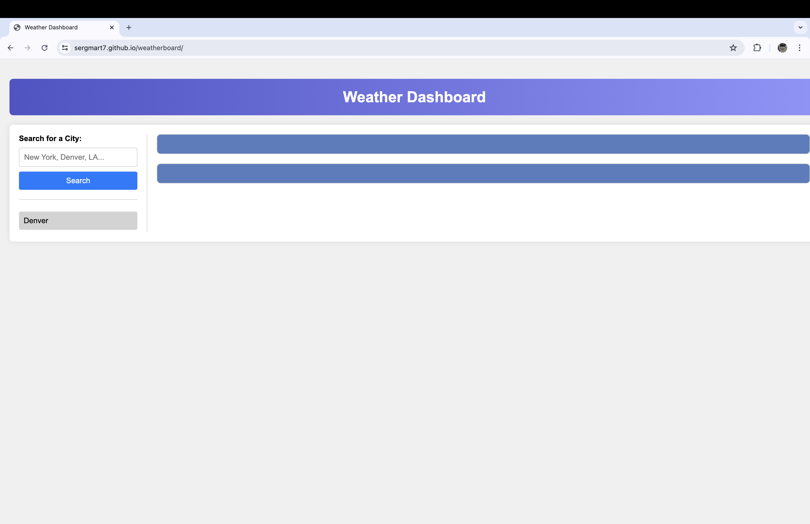
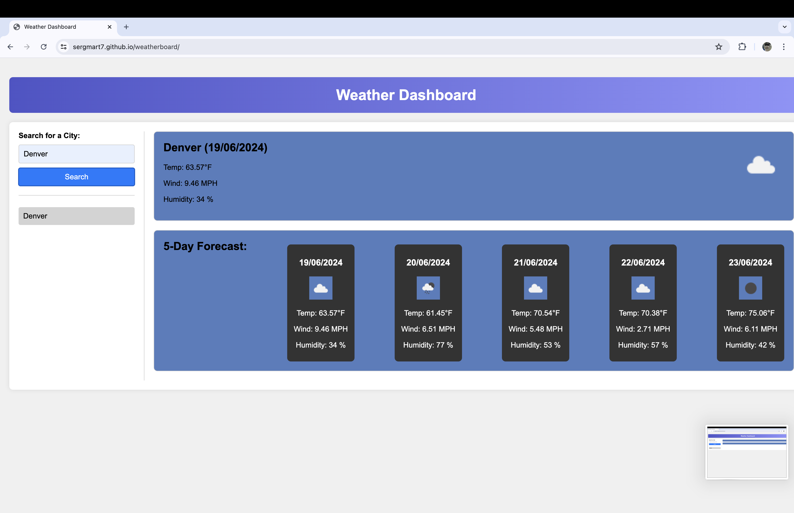
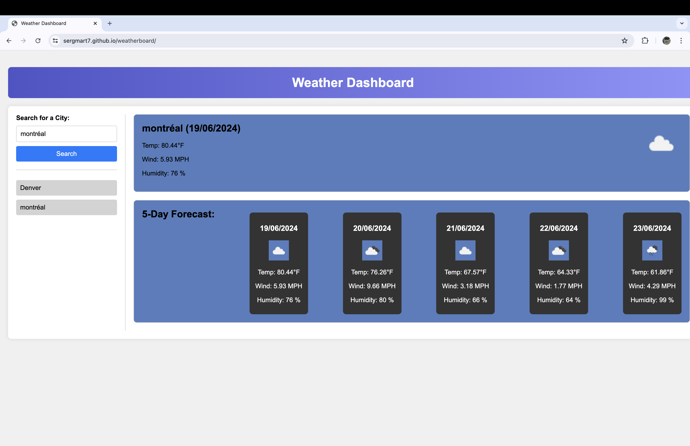

# weatherboard

##Usage

This weather app was created in order to be able to see how's the weather in your local area! It's not just limited to that, you also have the ability to search for the forcast in other cities.
This is a absolute reliable aplications as we have implemented an API key to a very trusted weather source. Whether, your planning for a vacation, or want to know how to dress appropiately for upcoming weather. We got you covered.

##Screenshots

Here it is in use:

## Links

Website:

https://sergmart7.github.io/weatherboard/

Want to check out the repo? Here you go:

https://github.com/SergMart7/weatherboard